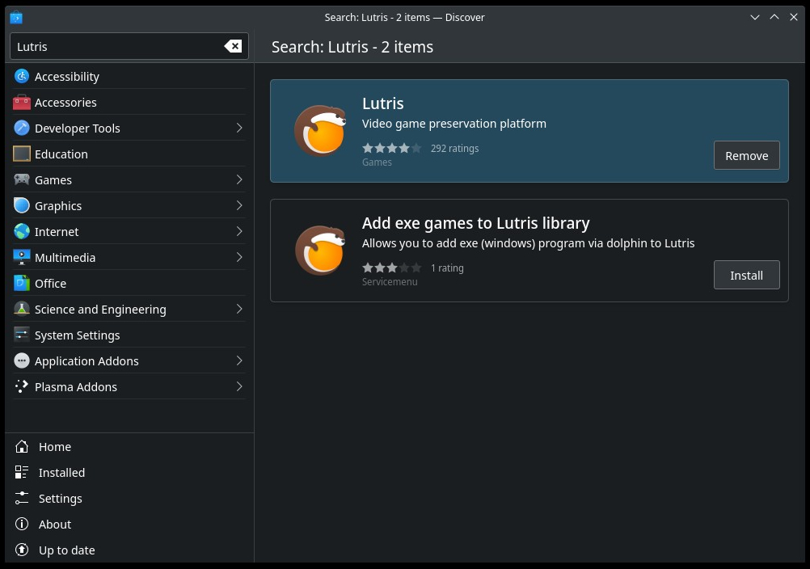
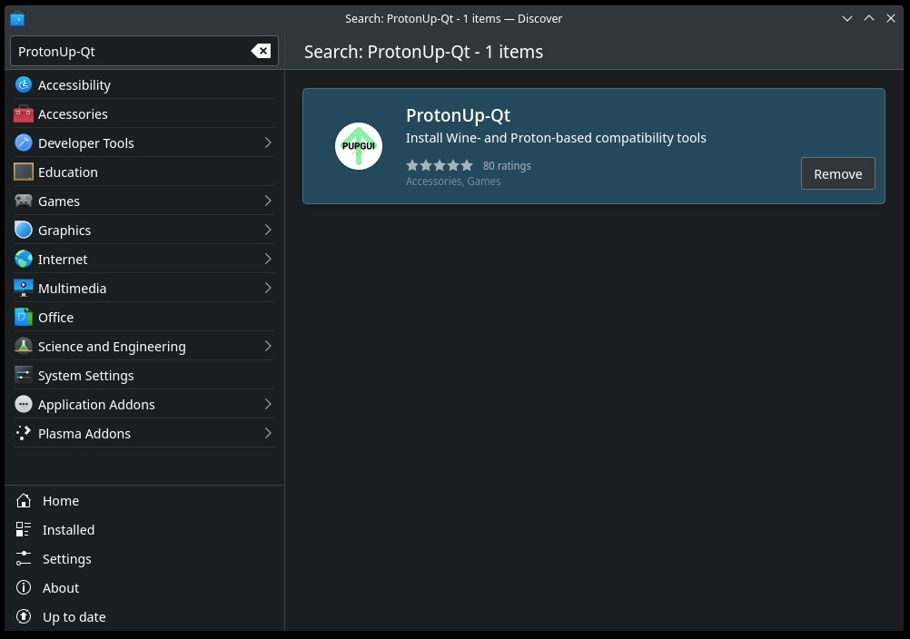
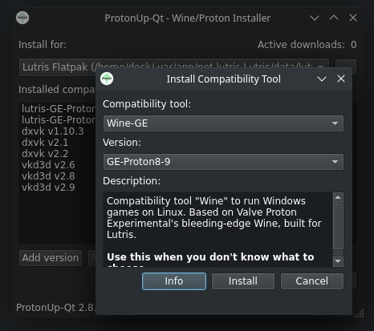
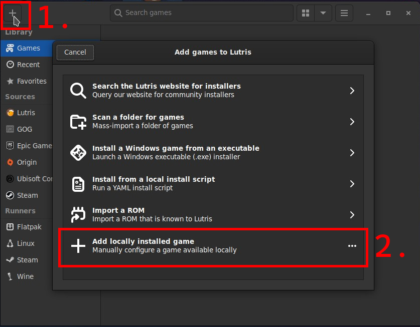
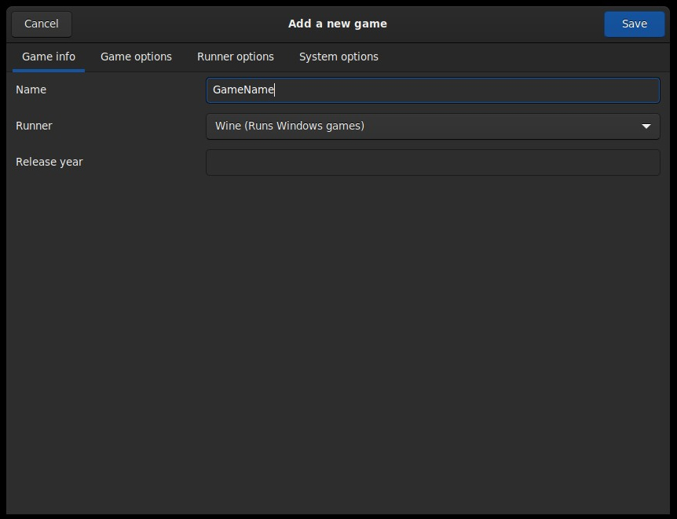
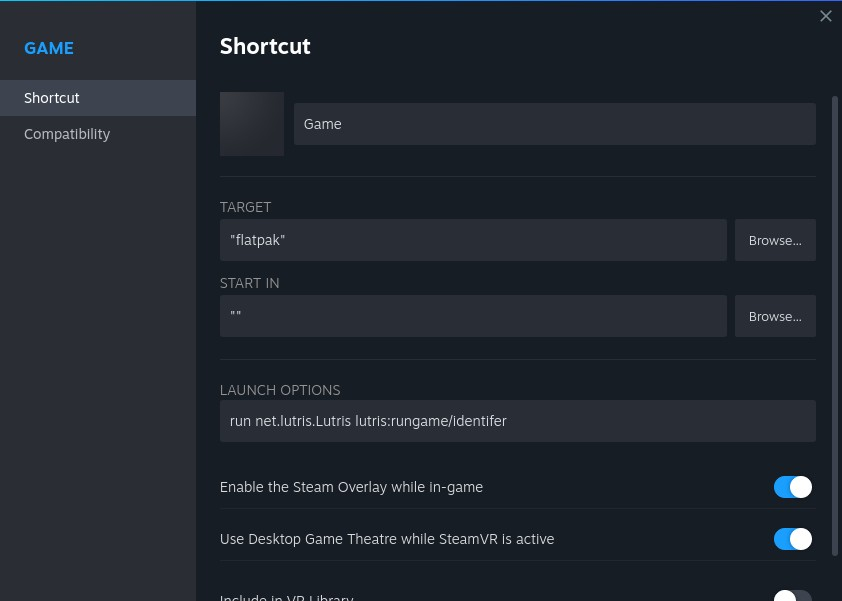

## Launching non-Steam games
### Lutris
You may use it to run Windows game, provided you have the installer for it. ~~Really convenient for pirated games~~.
1. Install `Lutris`. For example, you can do it from 'Discover' store.

2. Install `ProtonUp-Qt`.

3. Download `Proton` for your games to use.

4. Create folder for Lutris prefixes, wherever you like.
5. Launch/Focus Lutris app. Select 'Add game' button located top-left, then 'Add locally installed game' button.

6. Configure as follows and after that save changes:

   * `Game info` tab:
     - Choose the name for you game.
     - Select `Wine` as runner.
   * `Game options` tab:
     - Select wine prefix folder that was created earlier.
   * `Runner options` tab:
     - Select `lutris-GE-Proton#-##`.
7. Click on newly added game and then click `Run EXE inside Wine prefix` button.
8. Select your installer and let it do it's work.
9. After the installation is done, right click the game in Lutris and then click `Configure`:
   * `Game Options` tab:
     - Select executable file for Executable path (e.g. file to launch the game).
10. Try launching the game.
11. If step 10 doesn't work, check SteamDB for dependencies (your package/game), 
depots tab and then install them. You can do so like this:
    1. Right-click on the game, select `winetricks`.
    2. Choose `install Windows dll or components`. 
    3. Select needed ones (better one by one).
    4. It should now work.
12. Add Steam shortcut to quick launch it from Steam. 
Either through right-clicking on the game in Lutris and `Add Steam shortcut` 
or more reliably do it within Steam:
    * Steam -> click `Add non-Steam game` -> choose any app.
    * Change properties of this game like so:
      * `Target:` "flatpak"
      * `Start in:` ""
      * `Launch options:` run net.lutris.Lutris lutris:rungame/<here-goes-identifier-from-lutris-game-info>

---