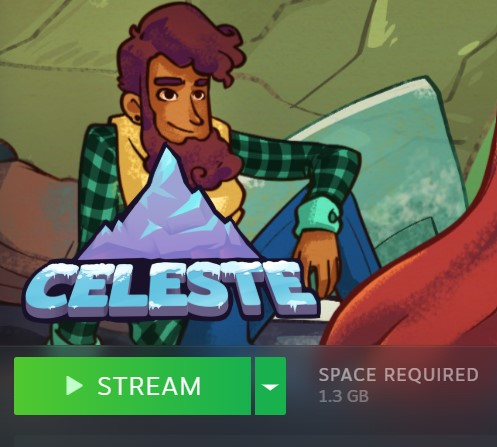

# Kade's Steam Deck
What I use for my own Steam deck.

---

## Contents
- [Hardware](#Hardware)
  - [Model](#Model)
  - [Docking station](#Docking-station)
  - [Charger](#Charger)
  - [Controllers](#Controllers)
  - [SD Card](#SD-Card)
- [Software](#Software)
- [Other](#Other)
- [SSH / File transfer](#SSH-File-transfer)
- [Emulation](#Emulation)
- [External game resolutions and upscaling](#External-game-resolutions-and-upscaling)
- [Streaming to other devices with Steam link](#Streaming-to-other-devices-with-Steam-link)
- [Performance](#Performance)
- [TODO List](#TODO-List)
---
## Hardware
### Model
* Steam Deck 256GB
### Docking station
* Valve Steam Deck Docking Station
### Charger
* Two chargers that came with docking station and Steam Deck itself.
  * Steam Deck Power Input: **45W USB Type-C PD3.0 power supply**.
  * The Steam Deck can be charged at a **maximum speed of 45W**.
  * There’s a **5,313mAh battery** inside the Steam Deck.
### Controllers
* 2x **_Playstation DualShock 3_**
  * Charged controllers via USB cables, which were connected to the docking station and plugged in powered Steam Deck. 
    Then connected both of them via Bluetooth. Works out-of-the-box.
* 1x **_Playstation DualShock 4_**
  * Bluetooth connection: hold down `PS Button` and `SHARE Button` 
    at the same time to enable pairing mode to make it available and visible for Steam deck.
  * Wired conenction: just plug it in.
  * You may change controller LED color in Steam controller settings.
### SD Card
* Kingston Canvas Go! Plus 256GB

The Steam Deck supports `SD`, `SDHC` and `SDXC` cards. 

Generally, application class `A2` is good.

For reference when choosing SD cards:


---
## Software
* [EmuDeck](https://www.emudeck.com/) - Convenient tool for setting emulators up.
* [Lutris](https://lutris.net/) - Installing games from `.exe`.
* [Heroic](https://heroicgameslauncher.com/) - GOG and Epic Games Launcher.
* [Cryo Utilities](https://github.com/CryoByte33/steam-deck-utilities) - Tweaking some of the settings (Swapfile, swap frequency, video memory).
---
## Other
* [SteamGridDB](https://www.steamgriddb.com/) - Setting up custom artwork for Steam Library.
  * Mostly useful for non-Steam games, such as ones added from Lutris. 
  * Note that there are 5 places for artwork to be set up:
    * Grid (Tile) - 600x900
    * Grid (Recently played) - 920x430
    * Icon - 256x256
    * Heroes(Banner) - 1920x620 
    * Logo
* GitHub repo [steam-deck-tricks](https://github.com/popsUlfr/steam-deck-tricks) - technical bits and pieces.
---
## SSH File transfer
### Start
1. Switch to Desktop mode.
2. Open the terminal.
3. Set password for default user, if you haven't already:
    ```shell
    passwd
    ```
### Enabling SSH
#### Simple (not recommended)
1. Start `sshd` service:
    ```shell
    sudo systemctl enable sshd.service --now
    ```
2. Done.
###### or
1. Enable `sshd` service:
    ```shell
    sudo systemctl enable sshd.service
    ```
2. Start `sshd` service:
    ```shell
    sudo systemctl start sshd.service
    ```
3. Get hostname IP address (for connecting to Steam deck from other machine):
    ```shell
    ip addr | grep inet
    ```
4. Done.

###### Misc - Use whenever needed
* To check the information about `sshd` (if needed):
    ```shell
    sudo systemctl status sshd.service
    ```
* Disable `sshd` for security reasons, after you no longer need it:
    ```shell
    sudo systemctl disable sshd.service --now
    ```

#### Recommended
##### Generate SSH keypairs:
```shell
ssh-keygen -t ed25519 -b 4096 -f ~/.ssh/id_ed25519
```
* `-t ed25519` : specifies the algorithm for the encryption. Default - RSA, ed25519 is fast and not part of NIST/NSA.

* `-b 4096` : specifies the key strength in this case 4096 bit encryption (default is 2048)

* `-f xxxxx` : specifies the filename/path

This will also prompt you to create a password, choose a strong one that you'll remember.

##### Install SSH key:
```shell
cat ~/.ssh/id_ed25519.pub >> ~/.ssh/authorized_keys
```
This appends your public key to your authorized keys

_Note: this is **the private key**._

##### Edit SSH configuration file:
Configuration file `sshd_config` path name is `/etc/ssh/sshd_config`.

1. Edit contents of this file to have following lines:
    ```
    PasswordAuthentication no
    ```
    ```
    PubkeyAuthentication yes
    ```
2. If those two lines start with a `#`, then remove the `#`.
3. Save the file.

##### Start SSHD service:
```shell
sudo systemctl start sshd.service
```

##### Using private key on Linux:
* Copy private key to ~/.ssh
    ```shell
    ssh-add ~/.ssh/id_ed25519
    ```
* then use
    ```shell
    ssh [Steam deck IP without the brackets]
    ```
* To get Steam deck IP:
    ```shell
    ip addr | grep inet
    ```
##### Using private key on Windows:
* Copy `~/.ssh/id_ed25519` file over to your other machine.
* You will need an SSH client and agent. Most common one is [PuTTY](https://putty.org/).
* Open `puttygen.exe`, go to load, select your private key, enter the password you set for it earlier.
* PuTTY uses `.ppk` file format for private keys, so hit `Save private key`.
* To load key into memory start `pagent.exe`. This should add an icon to your windows taskbar tray, right click the authorization agent, add key, browse to the `.ppk` you converted, enter password.
* You will need to start `pagent.exe` every time you want to connect to the deck.
* Start `putty.exe`. Enter your Steam Deck's IP address and port `22` (default port for SSH), hit connect.
* Default username is `deck`.
* To get Steam deck IP, use following command in its terminal:
    ```shell
    ip addr | grep inet
    ```

### Transfering files via `SCP` command:
#TODO
```shell
man scp
```

### Transfering files via SFTP client (WinSCP):
* Enter Steam Deck's hostname or ip address.
* Default port is `22` and default user is `deck`.
* Click `Advanced...` under `Advanced...`


* SSH -> Authentication. Private key file: select `.ppk` file generated earlier.


* Done
---
## Emulation

[//]: # (## ROMS)

[//]: # (* Torrents)

[//]: # (* https://r-roms.github.io/)

[//]: # (* Sony psp - https://r-roms.github.io/megathread/sony/#sony-playstation-portable)

[//]: # (* PS3 - https://nopaystation.com/)

Assuming you are using [EmuDeck](https://www.emudeck.com/). Also, my installation is located on SD card,
so the path might look like this `/run/media/mmcblk0p1/Emulation/`.
### Playstation 3 (PS3)
#### RPCS3 - Installing games
Slight chance to be required to install `Playstation3 system software update`/
* Put the game folder into `Emulation/roms/ps3/`

#### RPCS3 - Installing with .pkg and .rap
* Launch RPCS3
* `File` -> `Install .pkg/.rap` -> Select `.pkg`
* `File` -> `Install .pkg/.rap` -> Select `.rap`

### Playstation Portable (PSP)
#### PPSSPP - Installing games
* Put the `.iso` file into `Emulation/roms/psp/`

### Nintendo Switch
#### Ryujinx
##### Prerequisites
* Nintendo Switch Firmware (`.zip` or folder with a lot of files)
* File `title.keys`
* File `prod.keys`
##### Installation
* Move firmware,`title.keys` and `prod.keys` to `/home/deck/.config/Ryujinx/system/`.
* To quicker find this folder:
  * launch Ryujinx
  * Click in top left corner: `File`->`Open Ryujinx Folder`->`system`
* Install firmware:
  * Click `Tools`
  * Choose to install the firmware from a directory or a zip file
* Move supported game files to `Emulation/roms/switch/`. I have tried `.nsp` and `.xci`.
##### DLC and Updates
###### Update
* Right-click on the game.
* Click `Manage title updates` and `Add`. 
* Navigate to the corresponding file.
###### DLC
* Right-click on the game.
* Click `Manage DLC` and `Add`. 
* Navigate to DLC file.
##### Tweaking
###### Drifting stick
I had my left stick drifting downwards.
* Navigate to settings.
* Go to `Input` settings.
* Put some deadzone on joysticks, like `0.20` on both sticks.
---
## External game resolutions and upscaling
[Check out source article](https://medium.com/@mohammedwasib/a-guide-to-a-good-docked-gaming-experience-on-the-steam-deck-346e393b657a)

The resolution option within display settings:


The resolution that can be set within individual game’s properties by clicking on the gear icon:


Native Steam deck resolution is 1280 x 800px (16:10 aspect ratio)

Upscaling:
* Ingame — **FSR2.0** costs around 10fps in performance.
* Ingame — **TAAU/TSR** costs around 5fps in performance.
* Ingame — **FSR1.0** costs around 5fps in performance.
* Ingame — **Simple** upscaling(bilinear) costs nothing but is the worst.

Steam OS upscaling can be set in the overlay:
* SteamOS Upscaling — **FSR** costs the highest at around 5-10fps in performance but tends to generate results sharper and better than Integer scaling with no blur.
* SteamOS Upscaling — **Integer** looks the next best at integer scaling resolutions (1:2, 1:3) and costs nothing.
* SteamOS Upscaling — **Nearest** is the same as Integer at integer resolutions, but not as good at non integer resolutions. Cost is minimal too.
* SteamOS Upscaling — **Linear** looks the worst and introduces blur at low resolutions, but costs nothing.
---
## Streaming to other devices with Steam link
If you want to use your laptop, tablet or phone as display,
you can use Valve [Steam link](https://store.steampowered.com/app/353380/Steam_Link)
to stream apps and games from your Steam deck.

It's built-in into Steam client for PC or needs to be downloaded
for tablets and phones as separate app.

Useful when:
* Streaming games to your friends in Discord.
* Using OBS on your laptop to record gameplay from your Steam deck.
* Needing another display which has brains of it's own and doesn't work like
external monitor or TV.

### PC (Laptop/Desktop)
* Needs Steam client installed on PC and both devices be logged on in the same account.
* Might need to enable Remote play in the Steam settings.


* on PC, you will see your library be extended by the library from your deck and vice versa.
* `Play` button will be replaced by `Stream` button. If it doesn't show, then click
arrow down, next to `Install`/`Play`/`Stream`, to select device that will run the game.



### Mobile devices (Tablets/Phones)
* Download Steam link to your device.
* Follow in-app instructions.
* Pretty much the same as PC.

### Connection
Around 40 Mbit/s is fine.

###### Wireless
You need both devices to be connected to the same network, e. g. same Wi-Fi.

Preferably, use 5 GHz frequency and Wi-Fi 5 (IEEE 802.11ac) or higher 
(backwards compatibility; deck can't use better standard than 802.11ac).

**Pros:**
* Wireless
* Easy to set up

**Cons:**
* Latency
* Occasional stutters
* You need Wi-Fi router and get all Wi-Fi related problems, especially at 2.4 GHz.
###### Ethernet
* You need a way to connect your devices via Ethernet cable.
  * I use official docking station, laptop with Ethernet-to-USB adapter
  and 100Mbit/s Ethernet cable.
* On your laptop/tablet, nothing needs to be done, as far as I know.
* On your Steam deck, you need to change Wired connection IPV4 method to `Link-Local`.


* If your recieving device is connected to Wi-Fi, you might need to disable
Wi-Fi module to force Steam link to use wired connection. This might happen if 
it thinks bandwidth is better via Wi-Fi.

**Pros:**
* More responsive
* Doesn't depend on Wi-Fi routers
* Doesn't get wireless protocols problems

**Cons:**
* Wires
* Might be weird, if your bandwidth is better on Wi-Fi than on Ethernet

---
## Performance
### Swapfile, VRAM and swap frequency
Use [Cryo Utilities](https://github.com/CryoByte33/steam-deck-utilities) to  change them. Should make 
games and emulators run smoother in most of the cases.

Note on increasing VRAM to 4GB:
* Steam Deck has 16GB unified RAM, meaning it can act both as regular RAM and VRAM.
* Default minimum VRAM is set to 1 GB, but may be set higher in BIOS settings. 
* Depending on workload the GPU can access up to 8 GB. 


*  It's better if you can increase swapfile size, but you need to consider how much storage space will be left,
if you only have 64GB storage memory.
* Increasing the reserved amount of VRAM lowers the available regular RAM, 
so the larger swapfile makes sure you always have enough RAM available 
that the system doesn't lock up.


* As far as the benefits of increasing the minimum VRAM, 
the steam deck automatically allocates the RAM as either standard RAM or VRAM 
as needed.
* The problem is that it gives priority to regular RAM, 
so games that demand a lot of regular RAM and VRAM will give almost all 
of it to regular RAM, and only reserve 1GB for VRAM, 
if you haven't changed the value in BIOS settings.


* Most demanding games run better with 12GB (+swapfile) of standard RAM + 
4gb of VRAM than with 15Gb of RAM and 1Gb of VRAM. 
It still isn't getting as much RAM or VRAM as it wants,
but the balance is better and neither is so small that it's unusable. 
The only time this should hurt performance is in games that don't need more than 
1GB of VRAM, but need 12+GB of standard RAM.

### FSR
Sometimes, SteamOS FSR is better than ingame FSR performance-wise.

Disable ingame FSR and enable SteamOS one.
### DirectX
Steam provides shader cache to their Deck approved games, 
so that would reduce shader compilation which does cause stutter.
But that stutter should go away eventually.

With DX12 games and Proton the stutter should be mitigated a little bit 
due to the way DX12 compiles shaders.

With DX11 and the launch command `DXVK_ASYNC=1 %command%`
it should reduce the stutter with DX11 games.
### Steam overlay settings
Lock the framerate limit to 30 and disable any in-game vsync. 

“Allow Tearing” option in the overlay can help to reduce the input lag.
### More power to CPU
In CPU-heavy games, try to give CPU some more power budget by locking 
the GPU frequency to a lower value like 1200mhz.
---
## TODO List
Generally, it's the stuff I want to try out:

* [Having external drive for booting windows](https://www.youtube.com/watch?v=jlcjCpqLr54)
* [External ext4 drive for storing/using games while docked (with auto-mounting drive)](https://www.dexerto.com/tech/external-storage-on-steam-deck-1961757/)
* [Further experiments with Steam link separate app on Windows](https://www.reddit.com/r/SteamDeck/comments/xgrvha/comment/iousx6b/)
* [Try out decky plugins](https://decky.xyz/)
* Formatting SD card to BTRFS. Apparently, both Windows and Linux may read and write to them.
* write about Shader pre-caching